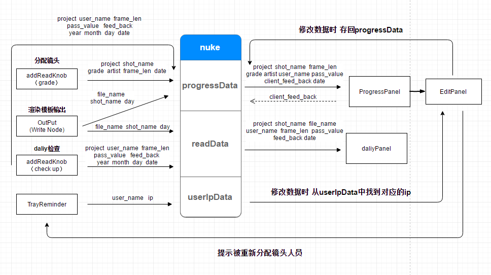

##项目数据产生及使用流程图

####详细说明：
共有3个数据库：progressData(项目进度数据库)、readData(daliy数据库)、userIpData(数据库)。
1. 当制作人员启动TrayReminder时，会自动发送该人员对应的用户名和ip到userIpData数据库中。
2. 分配镜头插件会将project(项目)、shot_name(镜头名)、grade(镜头难度等级)、artist(分配到的制作人员)、frame_len(镜头帧数)、date(日期)写入progressData数据库中。
3. 在制作人员完成镜头，使用渲染输出模板渲染完镜头后会自动将file_name(输出的镜头文件名)、shot_name(镜头名)、day(日)分别写入progressData和readData数据库中。
4. 当每天总监检查完镜头后，会把project、user_name(制作人员)、frame_len、pass_value(是否通过)、feed_back(反馈)、year(年)、month(月)、day(日)、date(日期)分别写入progressData和readData数据库中。
5. daliyPanel会从readData数据库中获取数据，将project、shot_name、file_name、user_name、frame_len、pass_value、feed_back、date数据展示出来。
6. ProgressPanel会从progressData数据库中获取数据，将project、shot_name、frame_len、grade、artist、user_name、pass_value、client_feed_back、date数据展示出来。
7. 当修改EditPanel(ProgressPanel的编辑面板)数据时，数据会实时存回progressData数据库，并且在artist(分配到的制作人员)被修改时会自动发送气泡提示给该对应的制作人员。
