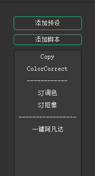

## CommonToolkit (节点预设管理器插件)

### 1.加载
1.在任意面板窗口上右键，选择windows->custom->预设工具：
（建议先将面板选择split horiztal 分成2个，然后在新分出来的面板执行以上操作)

2.点击Workspace->Save Workspace 保存当前Workspace。

3.按shift+s调出nuke设置面板，在设置面板中选中startup选项，设置成你刚才设置的那个名字的选择，然后点ok即可。

### 2.使用
1.添加节点

选择你要添加的节点，点击**添加预设**按钮，会弹出一个窗口，需要输入你预设的名字，然后点确定就会生成对应名字的预设按钮。
点击**添加脚本**按钮，会弹出一个脚本添加界面，可以通过导入按钮导入要添加的脚本，或者将脚本拖入文本框也可以导入插件，将名字设置好，点击添加即可。

2. 删除按钮
在想要删除的按钮上右键会有弹出一个删除菜单，选择该菜单即可。

3. 调整按钮顺序
按钮支持拖放调整顺序，执行按住你要调整的按钮拖到你想放的地方即可。

4. 使用预设
工具提供了2种使用方法：
    1. 双击使用。你可以双击想用的预设按钮即可在节点面板中生成对应的预设。
    2. 拖拽使用。选择要使用的按钮拖入节点窗口即可在指定位置生成对应的预设。