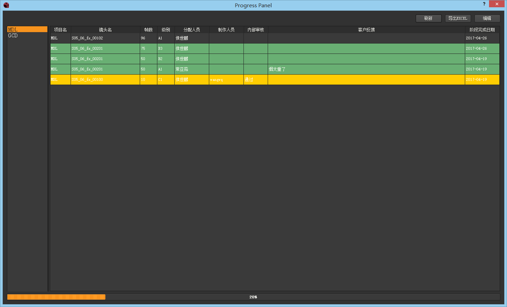
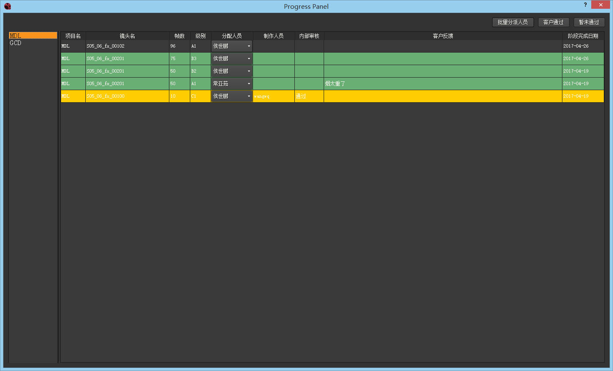

## ProgressPanel (项目进度面板插件)
我们可以在nuke的pipeline->ProgressPanel打开我们的项目进度面板。

在左侧选择每个项目会显示该项目的情况，黄色表示daliy通过的镜头，绿色表示客户通过的镜头，可以点击右上角的**导出EXCEL**按钮导出该项目的excel表格。

下方的进度条显示当前项目完成进度。

点击右上角**编辑**按钮会进入项目进度编辑面板

(这里加了一个lic文件验证，可以根据自身情况修改ProgressPanel文件夹的ProgressPanel.py中第125行内容，以及configure文件夹中的configure.py的lic路径)

可以根据自己的实际情况来修改其中的数据，修改后数据会实时的保存到数据库当中。

可以选择要修改的镜头，然后通过右上角的**客户通过**和**暂未通过**来设置这些镜头客户是否通过。

可以点击右上角**批量分派人员**来批量的修改分派的人员。
