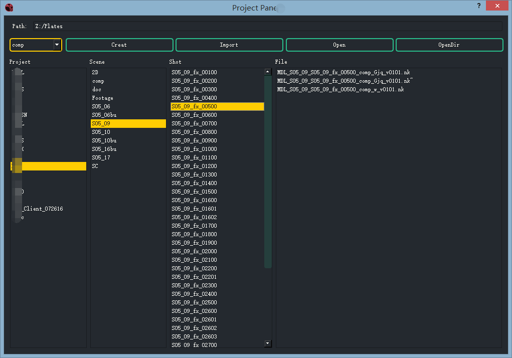

##ProjectPanel (工程项目面板插件)
我们可以在nuke的pipeline->ProjectPanel打开我们的工程项目面板。

该插件用于创建项目镜头对应的工程，工程的根目录可以在configure中的configure.py中设置。

默认工程素材路径：

Z:\Plates\Project Name\Scene Name\Shot Name

默认的保存路径：

Y:\Project\Project Name\nuke\Scene Name\Shot Name\comp

(以上路径可以根据自己的命名及路径规范修改代码)

第一个下拉菜单可以设置该工程输入什么类型的。

**Creat按钮：** 当shot列表框中选中你要的创建项目的镜头，点击这个按钮即可创建出对应的工程文件。

**Import按钮：** 点击该按钮可以将当前在shot列表中选中的镜头素材导入到当前工程中。

**Open按钮：** 在File列表中选中要打开的工程，点击这个按钮即可打开对应的工程。(双击File列表中的工程名称也可以打开该工程)

**OpenDir按钮：**  点击该按钮可以打开当前在shot列表中选中的镜头素材的文件夹。

在File列表框里面右键可以打开选中的工程文件所在的文件夹。