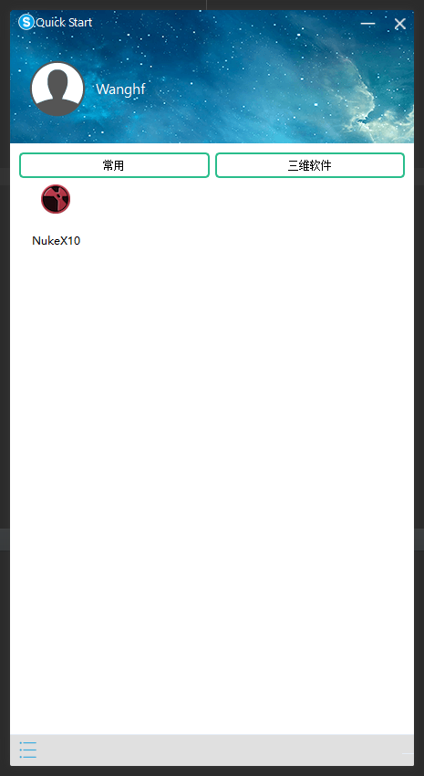
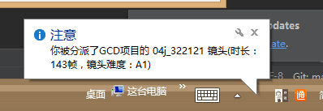

## TrayReminder (软件快速启动程序)
一款短小精悍的轻量级快速启动工具，你可以将常用的的软件拖放到软件窗口中，点击图标实现快速启动，使用起来非常方便快捷！

1. 添加软件
只需将要添加的软件或者快捷方式拖入软件中间即可生成对应的带图标的按钮。

2. 删除软件
在想删除的软件按钮上右键会弹出删除的按钮来，然后点击即可删除对应的按钮。

3. 添加分类
打开目录下的**config.json**文件，按照之前的2个分类格式编辑，软件就会自动加载所有分类。

点击右上方关闭按钮关闭主界面后，软件并没有关闭，会在右下角托盘处存在，可以在托盘处关闭。

当用户的被分派了新镜头时，会在右下角有气泡提示。

