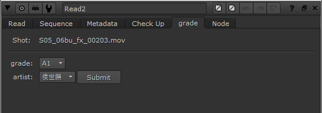
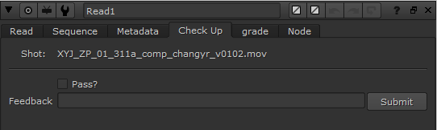

##addReadKonb (镜头分配及daliy审核插件)

该插件提供了镜头分配及daliy审核两大功能，所以该插件只给做镜头分配及审核的人员安装即可。

###1.镜头分配
将所有的素材导入nuke后，每个素材的read节点会有个grade标签页。

grade是设置该镜头的难度等级，artist是设置制作该镜头人员的名字（该人员名字列表来自于configure中的configure.py中的设置）。

当这两项都设置完成后，点击Submit就会将数据发送到数据库中。

###2.daliy审核
将当天要审核的daliy镜头导入nuke后，每个素材的read节点会有个Check Up标签页。

如果觉得当前镜头通过了，只需勾选Pass，然后点击Submit即可。
如果当前镜头需要修改，只需在Feedback中写入反馈意见，然后点击Submit即可。

